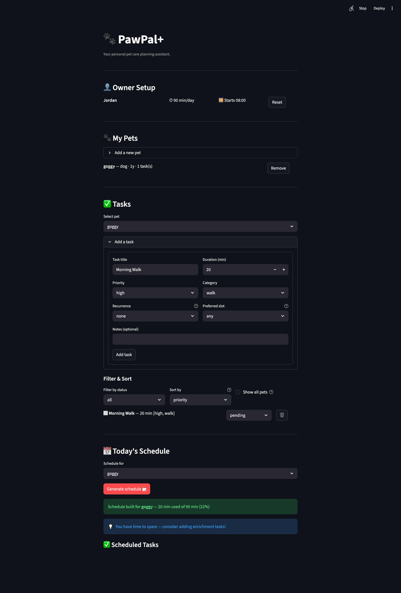
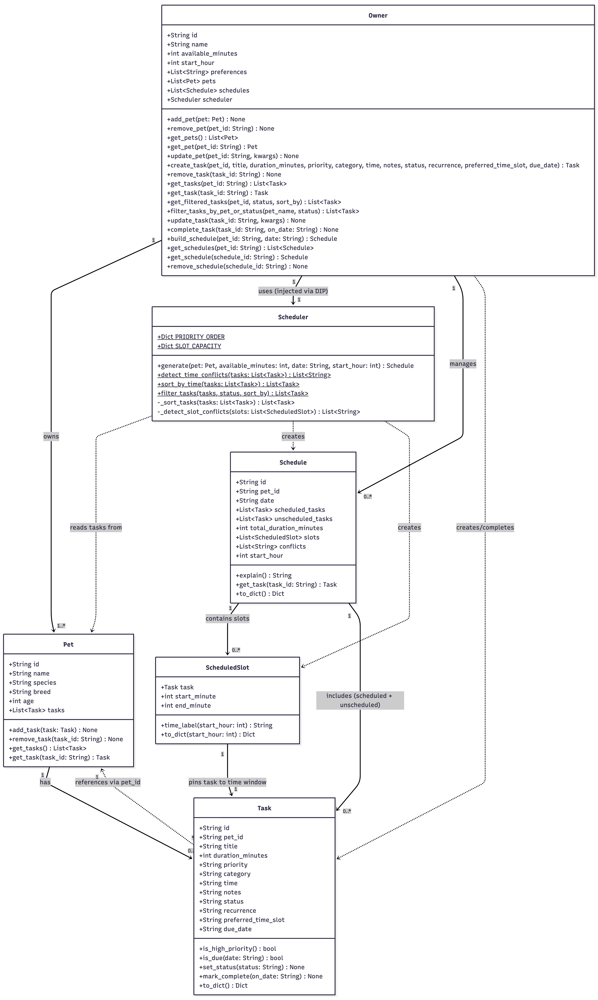

# 🐾 PawPal+

> **Your personal pet care planning assistant** — built with Python and Streamlit.

PawPal+ helps busy pet owners stay consistent with their pet care routine. It lets you track pets and tasks, generates a smart daily schedule based on your time budget and priorities, detects conflicts, and automatically creates the next occurrence of recurring tasks when you mark one complete.

---

## 📋 Table of Contents

- [Demo](#-demo)
- [Features](#-features)
- [Architecture](#-architecture)
- [Getting Started](#-getting-started)
- [Running the App](#-running-the-app)
- [Testing PawPal+](#-testing-pawpal)
- [Project Structure](#-project-structure)

---

## 📸 Demo

### Owner Setup


### Full App — Tasks, Schedule & Conflict Warnings


### UML Class Diagram (Final Implementation)


---

## ✨ Features

### 🗂 Pet & Task Management
- **Multi-pet support** — add as many pets as you need; each pet maintains its own independent task list.
- **Full task CRUD** — create, edit, complete, and delete tasks directly from the UI. Each task stores a title, duration, priority, category, preferred time slot, and optional notes.
- **Task status tracking** — tasks move through `pending → in_progress → completed` states with a single dropdown.

---

### 🧠 Scheduling Algorithm (Greedy Knapsack)
- **Priority-first scheduling** — `Scheduler.generate()` sorts tasks by priority (`high → medium → low`) before assigning time slots. Within the same priority, shorter tasks are placed first (greedy tie-break) to maximise the number of tasks that fit in the daily budget.
- **Time slot assignment** — scheduled tasks are assigned sequential `start_minute` / `end_minute` offsets via `ScheduledSlot`, rendered as human-readable `HH:MM–HH:MM` labels (e.g. `08:00–08:30`).
- **Budget overflow handling** — tasks that exceed the remaining time budget are placed in an "Unscheduled / Skipped" list, never silently dropped.
- **Due-date filtering** — tasks with a future `due_date` are automatically excluded from today's schedule; past or no-date tasks are always included.

---

### 🔁 Recurring Tasks (Automated Next Occurrence)
- **Daily recurrence** — marking a `daily` task complete automatically creates a new `pending` copy with `due_date` set to tomorrow (`timedelta(days=1)`).
- **Weekly recurrence** — same behaviour with `due_date` advanced by 7 days (`timedelta(days=7)`).
- **Weekdays recurrence** — after Friday, the next occurrence skips Saturday and Sunday and lands on Monday. Implemented with a `while next_date.weekday() >= 5` loop.
- **One-off tasks** — tasks with `recurrence="none"` are marked complete without spawning a follow-up.

---

### ⏱ Sorting by Time (Chronological View)
- **`Scheduler.sort_by_time()`** — a static method that uses Python's `sorted()` with a `lambda t: t.time` key to reorder tasks by their `HH:MM` clock attribute in strict chronological order.
- Available as the **"time (chronological)"** option in the task list's Sort By dropdown, giving owners a natural day-of timeline view alongside the standard priority/duration/category/title sorts.

---

### ⚠️ Conflict Detection (Two Layers)

#### Layer 1 — Same-time clash detection (`Scheduler.detect_time_conflicts`)
- Runs **live on every page render**, scanning all pending tasks for the selected pet.
- Builds a `dict[time → [task titles]]` and flags any time string with more than one task as a conflict.
- Displayed as a `st.warning` banner *before* the owner generates a schedule — the most actionable moment to alert them.

#### Layer 2 — Preferred time-slot overload (`Scheduler._detect_slot_conflicts`)
- Each time-of-day slot (`morning`, `afternoon`, `evening`) has a soft capacity in minutes (`SLOT_CAPACITY = {morning: 60, afternoon: 90, evening: 60}`).
- After the greedy fill, total minutes per preferred slot are summed. Any slot exceeding its capacity generates an overload warning in the schedule's `conflicts` list.
- High-priority task overflow is shown as a red `st.error` card; slot overloads appear as yellow `st.warning` cards.

---

### 📊 Professional Schedule Display
- Scheduled tasks rendered as a structured `st.table` with columns: **Time, Task, Duration, Priority, Category, Recurrence, Slot Preference**.
- Priority column uses colour-coded emoji indicators: 🔴 High · 🟡 Medium · 🟢 Low.
- Skipped tasks shown in a separate table with a caption explaining the time-budget reason.
- Utilisation bar: < 50% budget used → `st.info` tip to add enrichment tasks; > 90% → `st.warning` that low-priority tasks may be bumped.
- Full plain-text schedule explanation available in a collapsible expander (`Schedule.explain()`).

---

### 🔍 Filtering
- Filter task list by **status** (`all / pending / in_progress / completed`) and **pet** (single pet or all pets combined).
- `Scheduler.filter_tasks()` and `Owner.get_filtered_tasks()` power the filter logic server-side, keeping the UI layer thin.

---

## 🏗 Architecture

PawPal+ follows **SOLID design principles** with a clean separation between the logic layer (`pawpal_system.py`) and the UI layer (`app.py`).

```
Owner (root)
  ├── Pet 1..* ──→ Task 0..*
  ├── Scheduler (injected — Dependency Inversion)
  │     ├── generate()            ← greedy scheduling algorithm
  │     ├── sort_by_time()        ← static, chronological sort
  │     ├── detect_time_conflicts() ← static, same-time clash scan
  │     └── filter_tasks()        ← static, status/sort filter
  └── Schedule 0..* ──→ ScheduledSlot 0..* ──→ Task
```

| Class | Single Responsibility |
|---|---|
| `Task` | Data model + recurrence metadata |
| `Pet` | Owns and manages its task list |
| `ScheduledSlot` | Pins a task to a `start_minute`/`end_minute` offset |
| `Schedule` | Stores the result of a scheduling run; produces `explain()` output |
| `Scheduler` | Runs the greedy algorithm; exposes static utility methods |
| `Owner` | Root session object; delegates scheduling to `Scheduler` (DIP) |

---

## 🚀 Getting Started

### Prerequisites
- Python 3.11+
- pip

### Setup

```bash
# Clone the repo
git clone <your-repo-url>
cd pawpal

# Create and activate a virtual environment
python3 -m venv .venv
source .venv/bin/activate        # Windows: .venv\Scripts\activate

# Install dependencies
pip install -r requirements.txt
```

---

## ▶️ Running the App

```bash
streamlit run app.py
```

The app opens at **http://localhost:8501**.

---

## 🧪 Testing PawPal+

The automated test suite lives in `tests/test_pawpal.py`.

### Run all tests

```bash
source .venv/bin/activate
python -m pytest tests/test_pawpal.py -v
```

### What the tests cover — 70 tests across 8 classes

| Class | Tests | What's verified |
|---|---|---|
| `TestTask` | 11 | Status transitions, priority flags, `to_dict()` serialization, unique ID generation |
| `TestPet` | 9 | Task add/remove/get, mismatched `pet_id` guard, defensive list copy |
| `TestOwner` | 16 | Full pet & task CRUD, cross-pet task lookup, update validation |
| `TestScheduler` | 5 | Priority sort, greedy fill, budget overflow, empty-pet edge case |
| `TestSchedule` | 7 | `explain()` output, `to_dict()` keys, task retrieval by ID |
| `TestBuildSchedule` | 4 | Schedule deduplication, multi-pet isolation, removal |
| `TestSortingCorrectness` | 5 | `sort_by_time()` chronological order, immutability, edge cases |
| `TestRecurrenceLogic` | 6 | Daily/weekly/weekdays next-occurrence dates, non-recurring no-spawn |
| `TestConflictDetection` | 7 | Same-time clash warnings, false-positive checks, multi-slot conflicts |

### Confidence Level

⭐⭐⭐⭐⭐ **5 / 5**

All 70 tests pass in < 0.1 s. The suite covers happy paths, edge cases (zero-budget, empty pets, single-element lists), and boundary conditions (exact-fit budget, Friday → Monday weekday skip).

---

## 📁 Project Structure

```
pawpal/
├── app.py                  # Streamlit UI — connects to pawpal_system.py
├── pawpal_system.py        # Logic layer: Task, Pet, ScheduledSlot,
│                           #              Schedule, Scheduler, Owner
├── main.py                 # CLI smoke-test runner
├── tests/
│   ├── conftest.py         # Adds project root to sys.path for pytest
│   └── test_pawpal.py      # 70-test automated suite
├── uml.md                  # Mermaid class diagram (final implementation)
├── reflection.md           # Algorithmic trade-off notes
├── requirements.txt
├── Makefile
└── README.md
```
